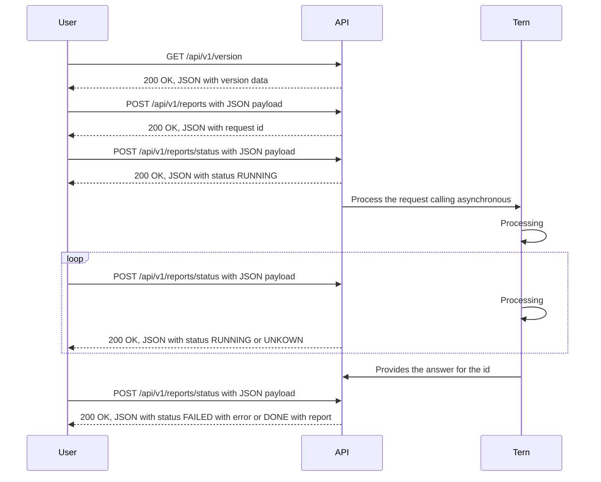

# Tern REST API

---
**NOTE**

This project still not functional. Please wait for the first functional release
(0.0.1)

---

The Tern REST API is a RESTful API for Tern Project.

Currently, the API is not functional as it is still in the Specification development and project structure phase.

The specification is available at [Tern REST API Offline Swagger](https://tern-tools.github.io/tern-rest-api/), and contributions are welcome.

Mainly the API is implemented asynchronously on the server-side as the tern
reports can take a while to be generated.



## Development

This repository has the ``requirements.txt`` and the ``requirements-dev.txt``
files to help build your virtual environment.

We also recommend using [Pipenv](https://pipenv.pypa.io/en/latest/) to manage your virtual environment.

```shell
$ pip install pipenv
$ pipenv shell
```

Install development requirements
```shell
$ pipenv install -d
```

### Running the development Tern REST API

#### As a Docker Container
```shell
$ make serve-dev
```
Open http://localhost/ in your browser.

Changing the source code will automatically reload the server inside the
container and makes the development easier.

You can stop the sever using ``Ctrl+C`` and running ``make stop``

#### On your local machine
Runing the API locally

```shell
$ flask run --reload
```

Open http://localhost:5000/ in your browser.

### Tests

We use [Tox](https://tox.wiki/en/latest/) to manage running the tests.

#### As a Docker Container
```shell
$ make tests
```

#### On your local machine
```shell
$ tox
```

### Documentation

```shell
$ make doc
```

The documentation tests are done also by ``tox``.

### Requirements

Installing new requirements

```shell
$ pipenv install {package}
```

Development requirements
```shell
$ pipenv install -d {package}
```

Updating packages
```shell
$ pipenv update
```

Updating the ``requirements.txt`` and ``requirements-dev.txt``
```shell
$ make update-requirements
```
