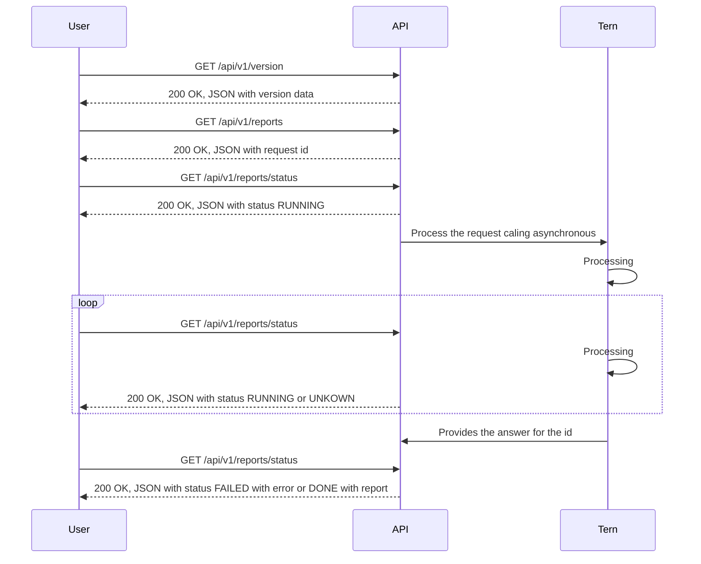

# Tern REST API

---
**NOTE**

This project still not functional. Please wait for the first functional release (0.0.1)

---

The Tern REST API is a RESTful API for Tern Project.

At the moment the API is not functional as it is still in the Specification
development and project structure phase.

The specification is available at
[Tern REST API Offline Swagger](https://tern-tools.github.io/tern-rest-api/) and
contributions are welcome.

Mostly of the API is implemented in asynchronous way on the server side as the
tern reports can take a while to be generated.



## Development

This repository has the ``requirements.txt`` and the ``requirements-dev.txt`` files to help building your virtual environment. I also recomend use pipenv to manage your virtual environment.

```shell
pip install pipenv
pipenv shell
pipenv install -d
```

Runing the API locally:

```shell
flask run --reload
```

Open http://localhost:5000/ in your browser.